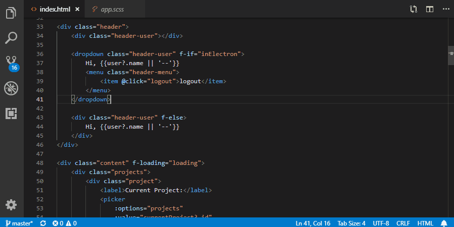
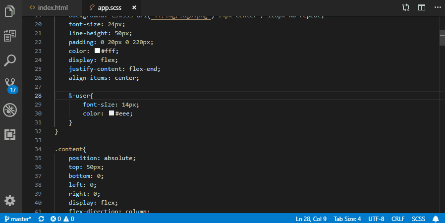

<h1 align="left">
    
    CSS Navigation - VSCode Extension
</h1>

Allows **Go to Definition** from HTML to CSS, provides **Completion** and **Workspace Symbols** for class & id name, and supports **Find References** from CSS to HTML.

## Features

### Go to Definition and Peek Definition

In a HTML document, or a HTML like document whose extension is specified by `activeHTMLFileExtensions`, choose `Go to definition` or `Peek definition`, the extension will search related CSS & Scss & Less selectors in current workspace folder as definitions.

Only within the word boundary of `<html-tag>`, `class="class-name"`, `id="id-name"`, you can `Go to definition` or `Peek definition`.

Nesting reference "&" in Scss or Less is automatically combined:

### Workspace symbols

Allow to search workspace symbols in CSS & Scss & Less files across all activated workspace folders.

### Class Name and ID Completion

Provide class name and id completion for your HTML files.

It doesn't support remote sources, and doesn't follow the `<link>` tags in your HTML file to limit the completion results, but lists all the defined class & id name in CSS & Scss & Less files of your workspace folders.

### Find All References and Peek References

Supports looking for CSS selector references in your HTML files.

This functionality should not be very usefull, and it needs to load and parse all the files configured in `activeHTMLFileExtensions` additionally. but if you love examining and refactoring CSS codes, at least it's much better than searching them in folders.

## Why started this project

At beginning, this project is a fork from [vscode-css-peek](https://github.com/pranaygp/vscode-css-peek/tree/master/client), which uses [vscode-css-languageservice](https://github.com/Microsoft/vscode-css-languageservice) as CSS parser. I just fixed some Scss nesting reference issues. I was inspired much by this project.

But then I found it eats so much CPU & memory. E.g., one of my project has 280 CSS files out of 5500 files, includes 6 MB of css codes. On my MacBook Pro, it needs 7s to load (1.3s to search files and 6s to parse) and uses 700 MB memory. Otherwise it keep parsing files every time you input a character, Let's assume you can input 10 characters in 1 second, since it's parse speed is about 1 MB/s, then if your document is more than 100 KB, your CPU usage will keep high.

So I decided to implement a new css parser, which also supports Scss & Less naturally, and then created a new extension. The CSS parser is very simple and not 100% strict, but it's fast and very easy to extand. Now it costs about 0.8s to search files, and 0.5s to parse them. Memory usage in caching parsed results is only about 3x~10x to file size.

Otherwise, all the things will be started only when required by default, so CSS files are loaded only when you begin to search definitions or others. You may change this behavior by specify `preloadCSSFiles` option.

After files loaded, The extension will track file and directory changes, creations, removals automatically, and reload them if needed.

Further more, I found the extension can support class name and id completion by the same core, so I do it with very few codes.

Finding references uses another core, I implement it because my work have a heavy CSS part, and I love refactoring CSS codes. I believe few people will need it.

## Stress Test & Performance

I loaded 100 MB (0.9 M declarations, 2.8 M lines) CSS files for stress test, it took 8s to parse them, and used about 850 MB memory. After 1 minute, the memory usage fell back to 550 MB. Searching definitions across all 0.9 M declarations cost about 50ms, searching workspace symbols cost about 500ms, and searching completions cost about 230ms.

My environment is Win10, MacBook Pro 2014 version (I love MacBook so much, until they removed the function keys😢), with power on.

## Plans & More

I just switched from Sublime Text to VSCode, this should be the first time I wrote a vscode extension.

I have plans to make this extension grow, I hope it can serve every frontend developers like me.

Please give me your feedbacks. Thanks.

## Configuration

| Name                              | Description
| ---                               | ---
| `activeHTMLFileExtensions`        | The languages of the html files, in where you can `go to definition`. Default value is `["html", "ejs", "erb", "php", "hbs", "js", "ts", "jsx", "tsx"]`.
| `activeCSSFileExtensions`         | The extensions of the css files, only the matched files you can `go to` and `peek`. Default value is `["css", "less", "scss"]`. Currently not support other languages, you can specify more extensions, but the related files will be parsed as CSS.
| `excludeGlobPatterns`             | A glob pattern, defines paths to exclude from when searching for CSS definitions. Default value is `["**/node_modules/**", "**/bower_components/**", "**/vendor/**", "**/coverage/**"]`.
| `alsoSearchDefinitionsInStyleTag` | Is `false` by default. When set to `true`, will also search CSS definitions in `<style>` tag for current document.
| `searchAcrossWorkspaceFolders`    | When `false` by default, only search CSS definition in current workspace folder. If your workspace folder requires css references from another workspace folder in current worksapce, you should set this to `true`.
| `preloadCSSFiles`                 | When `false` by default, CSS files are loaded only when required, that's why you need to wait for a while when searching for definitions at the first time. By set it to `true`, CSS files are loaded immediately after you change and save it or VSCode startup. If you are a heavy user in CSS definition searching, just check it.
| `ignoreSameNameCSSFile`           | When `true` by default, e.g.: If 'the-name.scss and 'the-name.css', which share the same basename, are exist in the same directory, the 'the-name.css' will be skipped. If you prefer compiling Scss or Less file to the same name CSS file, this would be very helpful.
| `ignoreCustomElement`             | When `true` by default, custom element definitions in CSS will be ignored, such that it will go to it's defined place directly.

## FAQ

### Can I change definition order to make sass files always before the css files?

No, VSCode always sort the definition results, seems in name order. If you don't like duplicate css definitions, you can remove the `css` in `activeCSSFileExtensions` option, or compile css file to the same folder, and keep `ignoreSameNameCSSFile` as `true`.

### Need to wait when I go to definition for the first time after workspace startup.

Everything work on lazy mode by default, so it will not take up CPU and memory early. Set `preloadCSSFiles` to `true` will cause CSS files are loaded before your need it, So you will get results immediately even for the first time.

### Can't get definitions across all workspace folders.

By default, definition searching is **limited in the same workspace folder**, that means when you choose `Go to definition` in a html file, the definitions you got are always come from the same workspace folder where the html file in. Searching references, completions also works like this.

If you have more than one folders in your workspace, and you definitely need to find definitions across them, set `searchAcrossWorkspaceFolders` to `true`.

### Missed some workspace symbols.

Workspace symbols are always come from multiple workspace folders, but for each workspace folder, you need to open one HTML or CSS file to **activate** it, then it will return results belong to it.

Set `searchAcrossWorkspaceFolders` to `true` will also activate services for all workspace folders as soon as possibile, then you will get full workspace symbols always.

### How the extension filter the selectors?

This extension only compare the last part of the selector, the parts are defined by spliting selector by space or several other characters like `>`, `+`, '~'.

So when you are trying to find definitions for `class="class1"`, these selectors will match: `p .class1`, `.class1.class2`, `.class1:hover`. but `.class2.class1` will not match, `.class1` must be in the front of the last part.

Searching tag definition is a little different, it must be the unique part of the selector, which means `p` will not match `div p`, but matches `p:hover`.

Searching completion works in the same way.

### Many duplicate definotions got. Can you limit the results to only in files specified by `<link>` tags, or check context to ensure the whole selector match?

It sounds like a good idea. For a complete static project, It should be very easy to follow `<link>` tags, matching whole selector is much harder, but it can also be done.

But the Web architecture is extremely complex today, all you got in your hand may be just a piece of html codes, an unique class name, that cause we can't get enough infomation about the context.

My suggestion is using unique class name, avoid nesting, which would be also helpful for the code quality of you project.

If you prefer scoped style, and write html and css codes in the same file, searching definitions should be less important for you. But checking option `alsoSearchDefinitionsInStyleTag` will also help you to search css definitions in your current document.

## License

MIT